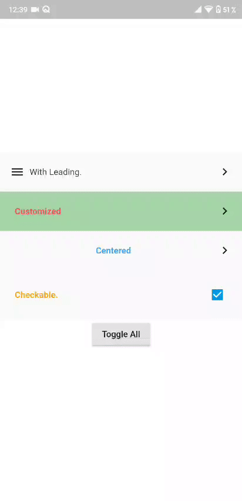

# flutter_expanded_tile

An Expansion tile similar to the list tile supports leading widget,checkbox option and programatic control with content expansion animation.

## Getting Started

### 1. Depend on it

Add this to your package's pubspec.yaml file:

```
dependencies:
  flutter_expanded_tile: [latest version]
```

### 2. Install it

```
$ flutter pub get
```

### 3. Import it

```
import 'package:flutter_expanded_tile/flutter_expanded_tile.dart';
```

## Example



```
.
.
 // Controller
  ExpandedTileController _controller;

  void initState() {
    // initialize controller
    _controller = ExpandedTileController();
    super.initState();
  }
  .
  .
ExpandedTile(
                controller: _controller,
                checkable: false, // check box enabled or not
                leading: Icon(Icons.menu),
                centerHeaderTitle: false,
                title: Text(
                  "With Leading.",
                  style: TextStyle(
                    color: Colors.grey[800],
                  ),
                ),
                content: Container(
                  child: Column(
                    children: <Widget>[
                      Text("text1"),
                      Text("text2"),
                    ],
                  ),
                ),
                contentBackgroundColor: Colors.green[100],
              ),
.
.

```

## Usage

| Property                                        | Description                                    | Default                                                                  |
| ----------------------------------------------- | ---------------------------------------------- | ------------------------------------------------------------------------ |
| **@required Text** title                        | Text Widget representing the title of the tile | **@required**                                                            |
| **@required Widget** content                    | Content which expands                          | **@required**                                                            |
| **@required ExpandedTileController** controller | Tile Controller                                | **@required**                                                            |
| **Widget** leading                              | leading widget before the title                | null                                                                     |
| **Icon** expandedIcon                           | ..                                             | !checkable? Icon(Icons.keyboard_arrow_right, color: Colors.black) : null |
| **bool** centerTitle                            | ..                                             | false                                                                    |
| **bool** rotateExpandedIcon                     | ..                                             | !checkable? true : false                                                 |
| **bool** checkable                              | Wheather tile has a checkbox or not.           | false                                                                    |
| **Color** headerColor                           | ..                                             | Color(0xfffafafa)                                                        |
| **Color** contentBackgroundColor                | ..                                             | Color(0xffeeeeee)                                                        |
| **Color** headerSplashColor                     | ..                                             | Color(0xffeeeeee)                                                        |
| **Color** checkBoxColor                         | check mark color                               | Color(0xffffffff)                                                        |
| **Color** checkBoxActiveColor                   | checkbox background color                      | Color(0xff039be5)                                                        |
| **EdgeInsetsGeometry** titlePadding             | ..                                             | EdgeInsets.all(8)                                                        |
| **EdgeInsetsGeometry** headerPadding            | ..                                             | EdgeInsets.all(16.0)                                                     |
| **EdgeInsetsGeometry** contentPadding           | ..                                             | EdgeInsets.all(16.0)                                                     |
| **Duration** expansionDuration                  | ..                                             | Duration(milliseconds: 200)                                              |
| **Curve** expansionAnimationcurve               | ..                                             | Curves.ease                                                              |

### Assertions

- Must not set **checkable** as true and define **expandIcon**.

## Built With

- Flutter - Beatiful native apps in record time.
- Android Studio - Tools for building apps on every type of Android device.
- Visual Studio Code - Code editing. Redefined.

## Contributing

Contributing is more than welcomed on any of my packages/plugins.
I will try to keep adding suggested features as i go.

## Versioning

- **V0.1.0** - Initial Release.
- **V0.2.0** - Added controller for programatic expansion and checkbox functionality.

## Authors

**Michael Aziz** - [Github](https://github.com/micwaziz)

## License

This project is licensed under the MIT License - see the [LICENSE.md](LICENSE.md) file for details
